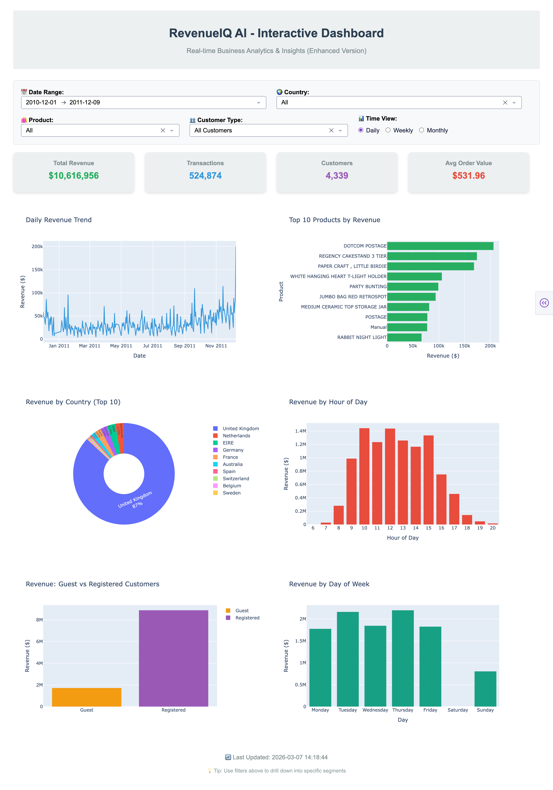
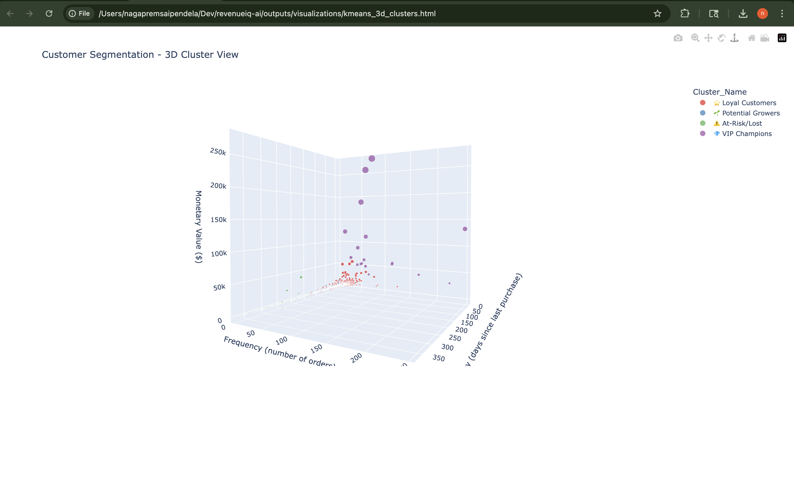
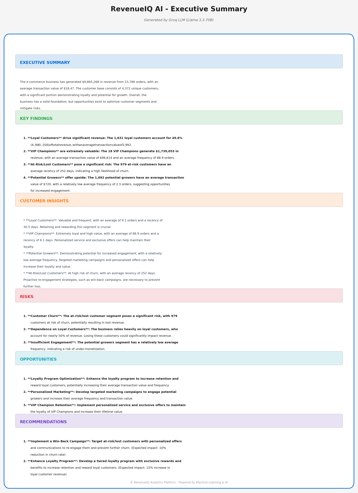

# 🚀 RevenueIQ AI - Business Intelligence Platform

> **$4M+ Revenue Opportunities Identified • 534K Transactions Analyzed • 5 ML Models Deployed**

Python | SQL | Machine Learning | Business Intelligence | LLM Integration

[](https://www.python.org/)
[](https://duckdb.org/)
[](https://groq.com/)
[](https://scikit-learn.org/)

---

## ⭐ Project Highlights

• Processed **534K real-world retail transactions**  
• Identified **$4M+ revenue opportunities** through segmentation & forecasting  
• Built **5 ML models** (forecasting, churn prediction, clustering, anomaly detection)  
• Optimized SQL analytics **7.74x faster** using DuckDB  
• Automated executive reports using **Groq LLM (Llama 3.3-70B)**  

---

## 💡 Why This Project Matters

- ✅ **End-to-end analytics pipeline** from raw data to AI-generated insights
- ✅ **Business-first approach** connecting ML to revenue impact
- ✅ **Production-ready code** with SQL optimization (7.74x faster queries)
- ✅ **AI automation** reducing manual reporting from 2 hours to 60 seconds
- ✅ **Real-world complexity** handling missing data, duplicates, outliers

---

## 📊 Dashboard Preview



*Real-time analytics dashboard with customer segmentation and revenue trends*



*Machine learning-powered customer segmentation (KMeans, k=5)*



*Automated executive summary generated by Groq LLM*

---

## 🎯 Business Impact

| Metric | Result | Business Value |
|--------|--------|----------------|
| **Revenue Analyzed** | $10.6M | Full business scope |
| **VIP Customers Identified** | 18 (0.4% of base) | $1.74M revenue (21% of total) |
| **Churn Recovery Potential** | 978 at-risk customers | $96K–144K recoverable |
| **Revenue Forecast** | $1.61M (next 30 days) | Planning accuracy |
| **Anomalies Detected** | 5,249 transactions | Fraud prevention |

**🎯 Key Finding:** 18 VIP customers generate **$96K each annually**. Retention strategy critical.

---

## 🛠️ Technical Stack

| Layer | Tools |
|------|------|
| **Data Processing** | Python, Pandas, NumPy |
| **Database** | DuckDB (SQL analytics) |
| **Machine Learning** | Scikit-learn, Statsmodels |
| **AI / LLM** | Groq API (Llama 3.3-70B) |
| **Visualization** | Plotly Dash, Matplotlib, Seaborn |

---

## 🤖 ML Models & Performance

| Model | Purpose | Validation Metric |
|------|---------|-------------------|
| **Exponential Smoothing** | Revenue Forecasting | MAE: $18,365 |
| **Random Forest** | Churn Prediction | F1 Score: 0.95 |
| **KMeans (k=5)** | Customer Segmentation | Silhouette: 0.446 |
| **Isolation Forest** | Anomaly Detection | 1% flagged |
| **ARIMA (1,1,1)** | Time Series Analysis | RMSE: $30,323 |

> Churn model performance is strong due to a clear inactivity threshold (~90 days). Production deployment would include monitoring for concept drift.

---

## 💎 Customer Segments Discovered

| Segment | Count | Revenue | Strategy |
|-------|------|------|------|
| 💎 VIP Champions | 18 | $1.74M | Dedicated account managers |
| ⭐ Loyal Customers | 1,631 | $4.88M | Tiered loyalty program |
| 🌱 Potential Growers | 1,692 | $1.22M | Nurture campaigns |
| ⚠️ At-Risk | 978 | $451K | Win-back offers |

---

## 🚀 Quick Start

```bash
# Clone repository
git clone https://github.com/premsai-pendela/revenueiq-ai.git
cd revenueiq-ai

# Install dependencies
pip install -r requirements.txt

# Configure environment
cp .env.example .env

# Run analysis pipeline
python src/data_cleaning.py
python src/predictive_models.py
python src/kmeans_clustering.py
python src/sql_analytics.py
python src/groq_insights.py

# Launch dashboard
python src/dashboard.py
```

Open browser → http://127.0.0.1:8050

---

## 📂 Project Architecture

```text
534K Transactions
        ↓
Data Cleaning Pipeline
        ↓
DuckDB SQL Analytics
        ↓
Machine Learning Models
        ↓
AI Insight Generation (Groq LLM)
        ↓
Interactive Plotly Dash Dashboard
```

---

## 🎓 Skills Demonstrated

### Data Engineering
- ETL pipeline design
- Data quality validation
- Feature engineering

### SQL & Database
- DuckDB query optimization
- Analytical queries & joins

### Machine Learning
- Time series forecasting
- Customer segmentation
- Churn prediction
- Anomaly detection

### AI Integration
- LLM API integration
- Prompt engineering
- Automated business reporting

### Business Analytics
- Customer lifecycle analysis
- Revenue forecasting
- Churn prevention strategies

---

## 👤 Author

**Naga Prem Sai Pendela**  
Data Analyst | Machine Learning | Business Intelligence  

GitHub: https://github.com/premsai-pendela  

---

⭐ If this project helped you, please consider starring the repository!