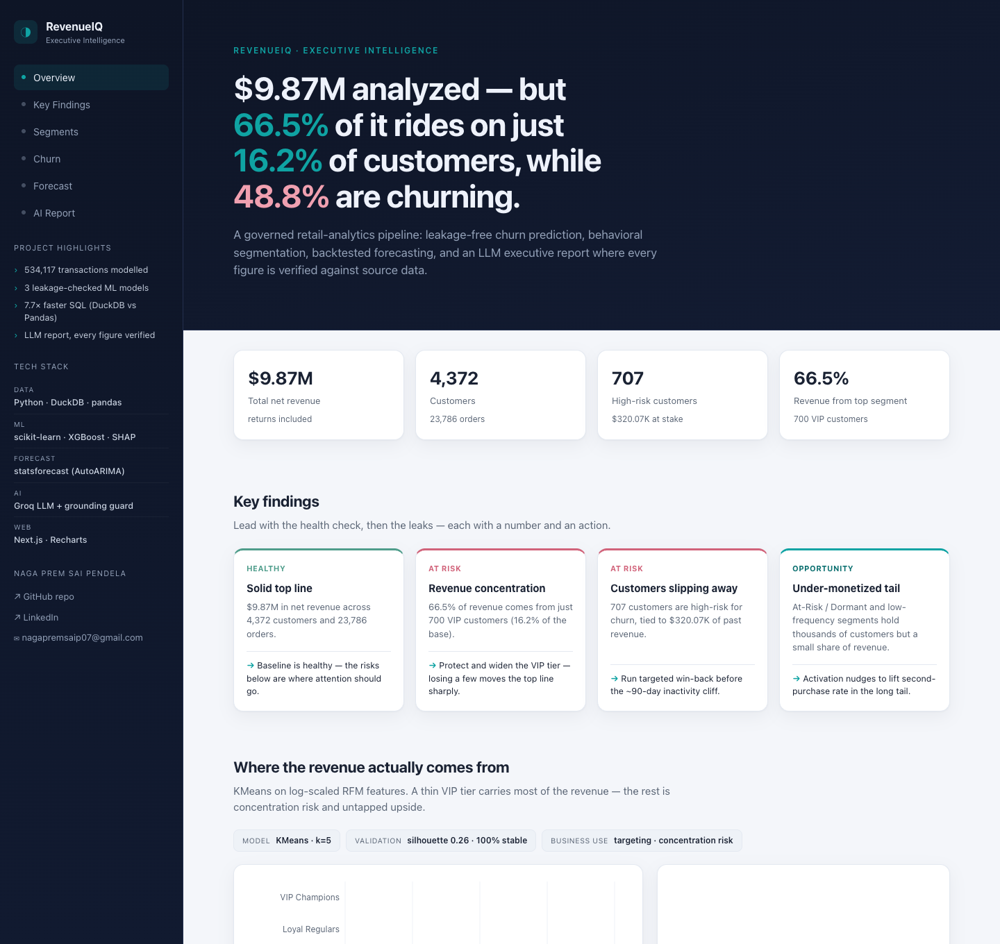
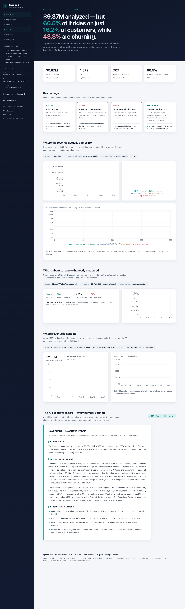

# RevenueIQ AI — Governed Retail Analytics

> Turn a year of raw e-commerce transactions into an executive brief — with **leakage-checked ML**, a **backtested forecast**, and an **LLM report where every number is verified against source data**.

Python · DuckDB · scikit-learn · XGBoost · SHAP · statsforecast · Groq LLM · Next.js

[](https://www.python.org/)
[](https://duckdb.org/)
[](https://scikit-learn.org/)
[](https://groq.com/)
[](https://revenueiq-ai.vercel.app)

**Live demo → https://revenueiq-ai.vercel.app**

---

## What this is

A reproducible pipeline over the public **UCI Online Retail** dataset (534,117 transactions, Dec 2010 – Dec 2011). It cleans the data, models it, and produces an interactive executive dashboard. The point of the project is not "an ML zoo" — it's **doing a small number of models honestly** and making the AI-written summary **verifiable**.

- **Leakage-free churn** — features from the first ~10 months, outcome from the last ~3, so recency can't leak the label. ROC-AUC **0.72** / PR-AUC **0.68** (an honest number, not an inflated one).
- **Behavioral segmentation** — KMeans on log-scaled RFM (k=5, silhouette 0.26, 100% stable across seeds). Surfaces that **16% of customers drive 66.5% of revenue**.
- **Backtested forecasting** — AutoARIMA validated by 5-fold walk-forward; MAPE **27.9%**, beating a seasonal-naive baseline by **13.5%**, with 95% prediction intervals.
- **Grounded LLM report** — an LLM writes the executive brief, and a **grounding guard verifies every dollar/percent/count against the model metrics**, regenerating anything it can't trace. Latest run: **all figures grounded (score 1.0)**.

---

## Dashboard

Interactive Next.js dashboard (two-tone theme, Recharts): headline finding → key findings → segments (bar / donut / value-vs-recency scatter) → churn (metrics + SHAP drivers) → forecast with confidence band → the grounded AI report with a live "figures verified" badge.

[](https://revenueiq-ai.vercel.app)

_Overview: headline finding, KPIs, and the key-findings cards._



_Full dashboard: segments (bar / donut / value-vs-recency scatter), churn with SHAP drivers, forecast with confidence band, and the grounding-verified AI report._

---

## ML models & honest metrics

| Model | Method | Validation | Note |
|---|---|---|---|
| **Churn** | XGBoost / RandomForest / LogReg (compared) | ROC-AUC **0.72**, PR-AUC **0.68**, precision@200 ≈0.67 | Time-split design; a programmatic **leakage check** asserts recency-to-cutoff is not a feature |
| **Segmentation** | KMeans, k=5, log-scaled RFM | silhouette **0.26**, **100%** stable across seeds | Named from ranked stats; GMM cross-checked |
| **Forecasting** | statsforecast **AutoARIMA** | MAPE **27.9%** (walk-forward), **+13.5%** vs seasonal-naive | 95% prediction intervals |
| **LLM report** | Groq (Llama 3.3-70B) + **grounding guard** | **100% of figures grounded** to source | Regenerates ungrounded numbers |

Explainability via **SHAP** (top churn-risk drivers: narrow product range, low order frequency, short tenure — attribution, not proven causation).

---

## Customer segments discovered

| Segment | Customers | Revenue | % of revenue |
|---|---|---|---|
| 💎 VIP Champions | 700 | $5.54M | 66.5% |
| ⭐ Loyal Regulars | 1,391 | $1.71M | 20.5% |
| 🌱 High-Value Growers | 272 | $0.42M | 5.0% |
| 🛒 Occasional Buyers | 1,145 | $0.41M | 5.0% |
| ⚠️ At-Risk / Dormant | 812 | $0.25M | 3.0% |

The story: a thin VIP tier carries most of the revenue (concentration risk), and a large low-frequency tail is under-monetized (upside).

---

## The grounding guard (the interesting part)

Executive reports fail when an LLM invents numbers. Here, the LLM is given **only** a registry of real figures computed by the models, and after it writes, a guard **extracts every currency/percentage/count and checks it against that registry** (rounding-tolerant, closest-match). Ungrounded numbers are fed back and regenerated (up to 3 passes). A full audit — every number → its source fact — is saved to `outputs/metrics/report_grounding.json`.

In practice it catches real hallucinations: on recent runs the model tried to invent a "95%" retention figure that exists nowhere in the data — the guard flagged it, fed it back, and regenerated to **every figure grounded (score 1.0)**.

---

## Architecture

```text
534K transactions (UCI Online Retail)
        ↓  clean + model in DuckDB
   ┌────────────┬──────────────┬───────────────┐
 churn        segmentation   forecasting        → outputs/metrics/*.json
 (XGBoost)     (KMeans)       (AutoARIMA)
        ↓
 grounded LLM report  ── grounding guard ──▶ verified executive brief
        ↓
 Next.js dashboard (static, deployed on Vercel)
```

---

## Quick start

```bash
git clone https://github.com/premsai-pendela/revenueiq-ai.git
cd revenueiq-ai

python -m venv venv && source venv/bin/activate
pip install -r requirements.txt
cp .env.example .env          # add GROQ_API_KEY for the LLM report

# 1) rebuild the models (writes outputs/metrics/*.json)
python src/models/churn_model.py
python src/models/segmentation_model.py
python src/models/forecasting_model.py

# 2) generate the grounded executive report
python src/llm/grounded_report.py

# 3) export dashboard data + run the web app
python scripts/export_dashboard_data.py
cd web && npm install && npm run dev     # http://localhost:3000
```

Deploy: the dashboard is a static Next.js app in `web/` — import the repo on Vercel with **Root Directory = `web`**.

---

## Honesty & limitations

This is a **demonstration of method on a single public dataset**, not a live production system.

- One gift-shop's ~13 months of data — enough to *describe* a yearly cycle, not *learn* one; only weekly seasonality is validated.
- Business figures are **model outputs and projections**, not realized revenue.
- The churn model's original version had **target leakage** (recency was both a feature and the label); that was found and fixed with a time-split design, which is why the honest AUC (0.72) is lower than a leaky model's (~0.95) — and far more defensible.

---

## Author

**Naga Prem Sai Pendela** — [GitHub](https://github.com/premsai-pendela) · [LinkedIn](https://linkedin.com/in/nagapremsai-pendela) · nagapremsaip07@gmail.com
